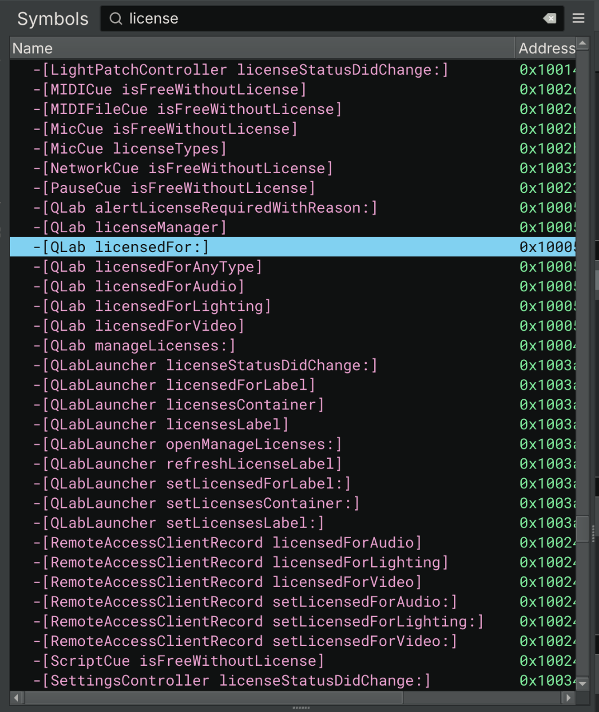

# Patching QLab (is simpler than you would think)

Let me prefix this post by saying: QLab is an amazing piece of software. If you have the budget, please support the developers. This post purposefully doesn't provide pre-patched files, just observations from reverse-engineering QLab.

## Introduction

QLab is a theatre cueing system that allows you to control audio, video, lighting, and more from a centralized list of cues. It has a generous free tier and a lot of capabilities... until you want to add an audio filter or seriously use lighting. After discovering these issues, I ran to my director and begged her to buy tech a QLab license, but to no avail, since we were truly running on a shoestring in my community theater. So, I set out on my own quest...

## Recon and Initial Analysis

To start, I opened the Mach-O binary in aarch64 mode in Binary Ninja. I'm running this on a real physical Mac, which means that I'm stuck with Apple silicon and therefore, ARM. This doesn't prove to be too much of an issue, really, but analysis took exponentially longer as compared to x64 for some obscene reason. After about an hour of Binja chugging away at the binary. But once it loads...



Oh yes. Oh yes! Symbols! So many symbols! You really love to see it. Tracing everything back, most (if not all) of the licensing checks in the entire app trace back to `-[QLab licensedFor:]`. A simple patch of the last opcode gets us a function that always returns `0x1` (`true`):

```asm
1000503fc    bool -[QLab licensedFor:](struct QLab* self, SEL sel, id licensedFor)

1000503fc  f657bda9   stp     x22, x21, [sp, #-0x30]! {__saved_x22} {__saved_x21}
100050400  f44f01a9   stp     x20, x19, [sp, #0x10] {__saved_x20} {__saved_x19}
100050404  fd7b02a9   stp     x29, x30, [sp, #0x20] {__saved_x29} {__saved_x30}
100050408  fd830091   add     x29, sp, #0x20 {__saved_x29}
10005040c  f30300aa   mov     x19, x0
100050410  e00302aa   mov     x0, x2
100050414  70e91594   bl      _objc_retain
100050418  f40300aa   mov     x20, x0
10005041c  e00313aa   mov     x0, x19
100050420  f49a1694   bl      0x1005f6ff0  {data_100050424}
100050424  fd031daa   mov     x29, x29 {__saved_x29}
100050428  74e91594   bl      _objc_retainAutoreleasedReturnValue
10005042c  f30300aa   mov     x19, x0
100050430  e20314aa   mov     x2, x20
100050434  578e1694   bl      0x1005f3d90  {data_100050438}
100050438  f50300aa   mov     x21, x0
10005043c  e00314aa   mov     x0, x20
100050440  62e91594   bl      _objc_release
100050444  e00313aa   mov     x0, x19
100050448  60e91594   bl      _objc_release
10005044c  200080d2   mov     x0, #0x1                                               ; <- Patched line
100050450  fd7b42a9   ldp     x29, x30, [sp, #0x20] {__saved_x29} {__saved_x30}
100050454  f44f41a9   ldp     x20, x19, [sp, #0x10] {__saved_x20} {__saved_x19}
100050458  f657c3a8   ldp     x22, x21, [sp], #0x30 {__saved_x22} {__saved_x21}
10005045c  c0035fd6   ret     
```

And, of course, all the other checks for licensing just go to this one function:

```c
100050460    bool -[QLab licensedForAudio](struct QLab* self, SEL sel)

100050460    {
100050460        /* tailcall */
1005f70c0        return _objc_msgSend(self, "licensedFor:");
100050460    }


10005046c    bool -[QLab licensedForVideo](struct QLab* self, SEL sel)

10005046c    {
10005046c        /* tailcall */
1005f70c0        return _objc_msgSend(self, "licensedFor:");
10005046c    }


100050478    bool -[QLab licensedForLighting](struct QLab* self, SEL sel)

100050478    {
100050478        /* tailcall */
1005f70c0        return _objc_msgSend(self, "licensedFor:");
100050478    }


100050484    bool -[QLab licensedForAnyType](struct QLab* self, SEL sel)

100050484    {
100050484        if (!(-[QLab licensedForAudio](self, "licensedForAudio") & 1) && !(-[QLab licensedForVideo](self, "licensedForVideo") & 1))
1005f7140            /* tailcall */
1005f7140            return _objc_msgSend(self, "licensedForLighting");
1005f7140        
1000504b4        return 1;
100050484    }
```

In order to use this patch on a Mac, you'll have to resign the `.app` bundle with an ad-hoc key:

```zsh
codesign --force --deep --sign - /path/to/QLab-Patched.app
chmod -R +x /path/to/QLab-Patched.app
xattr -r /path/to/QLab-Patched.app
```

To verify that everything is signed correctly:

```zsh
codesign -vvv --deep --strict /path/to/QLab-Patched.app
```

## That's all, folks

This was much shorter of a post that I anticipated, frankly. I was expecting to have to patch a lot more than a single opcode, but here we are, with a patch that works for every single licensed feature with no hassle whatsoever. This feels a bit immoral to publish, so I might end up keeping this post private out of principle. But, if you are in the future reading this, clearly I published *something*.

As always, written with :heart: by N3rdL0rd.
